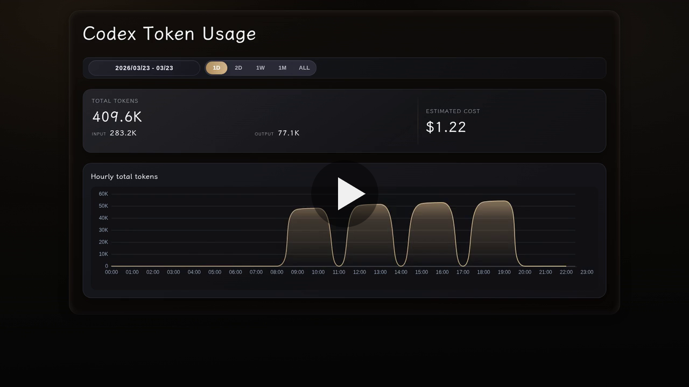

<div align="center">

# token-account

<p><strong>Persistent token usage service for Codex sessions</strong></p>

<p>
  <a href="./README.md">
    
  </a>
  <a href="./README.zh-CN.md">
    
  </a>
</p>

<p>
  Turn one-shot Codex token reports into a small service with incremental sync, multi-device aggregation, and a Swift-style React dashboard.
</p>

<p>
  
  
  
  
  
  
  
  
</p>

</div>

## Demo

<p align="center">
  <a href="https://github.com/githubbzxs/token-account/releases/download/readme-media-assets/demo-ui.mp4">
    
  </a>
</p>

<p align="center"><sub>Click the preview image to open the demo video. The demo uses fabricated sample data.</sub></p>

## Overview

`token-account` converts the original static HTML script into a long-lived FastAPI service backed by SQLite.

It accepts incremental sync uploads from one or more machines, deduplicates events by `event_id`, stores source status, and serves a React dashboard with native-feeling range controls, spring motion, and animated metrics.

## Features

- Long-lived HTTP service for token usage reporting
- Incremental sync from local Codex session logs
- Idempotent event ingestion with `event_id` deduplication
- Aggregated reporting across multiple devices
- Dashboard APIs plus a Vite-built React report page
- Swift-style segmented range control with shared-layout spring motion
- Animated metric digits for range changes and live refreshes
- Local sync state tracking for efficient repeated uploads

## tech stack

<p>
  
  
  
  
  
  
  
  
  
</p>

- API: `FastAPI`, `Pydantic`, `Uvicorn`
- Frontend: `React`, `Vite`, `Motion for React`, `ECharts`
- Storage: `SQLite`, `sqlite3`
- Sync client: `urllib.request`, local JSON state
- Reporting UI: React single-page app served by FastAPI, with legacy HTML fallback when no frontend build exists
- Packaging and deployment: `Python 3.11+`, `Node.js 22+`, `Docker`, `Docker Compose`

## Project Structure

```text
src/token_account/
  cli.py                  CLI entry for serve / sync / sync-loop
  service.py              FastAPI routes and service wiring
  syncer.py               Incremental sync client
  storage.py              SQLite schema and ingestion
  reporting.py            Report aggregation and payload building
  legacy_report.py        Legacy HTML fallback renderer
web/
  src/                    React dashboard source
  dist/                   Production frontend build output
src/codex_token_report.py Thin executable entrypoint
package.json              Frontend scripts and dependencies
vite.config.ts            Vite frontend build config
Dockerfile                Container image
docker-compose.yml        Compose service definition
pricing.json              Optional pricing overrides
```

## Quick Start

1. Install dependencies.

```bash
pip install -r requirements.txt
npm install
```

2. Build the React dashboard.

```bash
npm run build
```

3. Start the service.

```bash
python3 src/codex_token_report.py serve --host 0.0.0.0 --port 8000 --db-file data/token-account.db
```

4. Sync local Codex events once.

```bash
python3 src/codex_token_report.py sync --service-url http://127.0.0.1:8000
```

5. Keep syncing in the background.

```bash
python3 src/codex_token_report.py sync-loop --service-url http://127.0.0.1:8000 --interval 60
```

Default URLs after the service starts:

- Report page: `http://127.0.0.1:8000/`
- Dashboard API: `http://127.0.0.1:8000/api/dashboard`
- Report API: `http://127.0.0.1:8000/api/report`
- Sources API: `http://127.0.0.1:8000/api/sources`
- Health API: `http://127.0.0.1:8000/api/health`

On Windows, you can also double-click `open-report.bat` to start the local service in the background and open the browser automatically.

During frontend development, run the API service and Vite dev server in separate terminals:

```bash
npm run dev
```

## CLI Commands

### `serve`

Start the FastAPI service.

Common options:

- `--host`: bind address, default `127.0.0.1`
- `--port`: bind port, default `8000`
- `--db-file`: SQLite file path, default `data/token-account.db`
- `--pricing-file`: optional pricing override file

### `sync`

Scan local `.codex/sessions` data and push normalized token events to the service.

Common options:

- `--service-url`: service base URL, default `http://127.0.0.1:8000`
- `--codex-home`: custom `.codex` root
- `--sessions-root`: direct path to the `sessions` directory
- `--state-file`: local sync state file
- `--source-id`: source device identifier
- `--hostname`: source host name
- `--batch-size`: upload batch size, default `1000`
- `--timeout`: HTTP timeout in seconds, default `30`

### `sync-loop`

Run `sync` repeatedly for daemon, scheduler, or `systemd` usage.

Extra option:

- `--interval`: sync interval in seconds, default `60`

## Data Model

- Events are stored individually and deduplicated by `event_id`
- Device metadata is preserved in the `sources` table
- Sync runs are recorded for troubleshooting and status display
- The HTML report polls fresh report data periodically from the service

## Docker Compose

The repository includes `Dockerfile` and `docker-compose.yml`.

Default container command:

```bash
python src/codex_token_report.py serve --host 0.0.0.0 --port 8000 --db-file /data/token-account.db
```

Start it with:

```bash
docker compose up -d --build
```

The Docker image builds the React dashboard in a Node.js stage, then copies the static output into the Python runtime image. The local `./data` directory is mounted to `/data` for SQLite persistence.

## Acknowledgements

Thanks to the [Linux.do community](https://linux.do) for the ongoing discussion, sharing, and practical feedback around Codex workflows, self-hosted tooling, and deployment experience.

Projects like this benefit a lot from communities that openly exchange scripts, ideas, and real-world usage patterns.

## Security Note

The current service does not add authentication.

If you expose it to a public network, anyone who can reach the service can read report data, inspect source status, and submit sync payloads. Put it behind a reverse proxy, access control, or add an auth layer before wider exposure.
